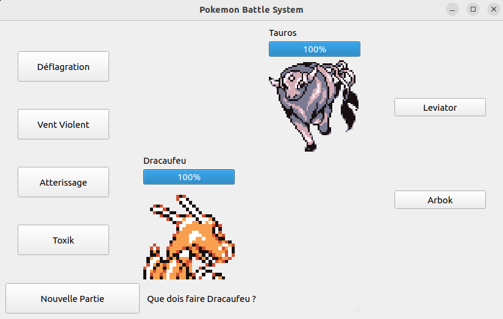
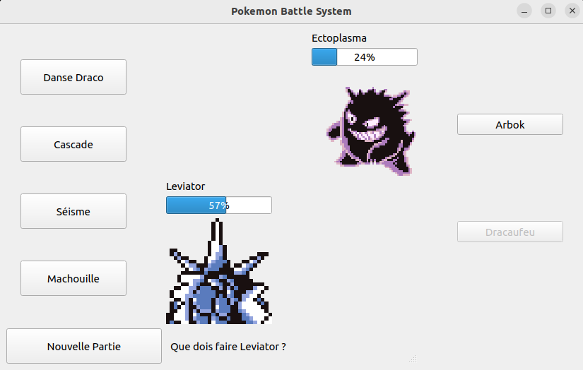

# Pokemon Battle System

*Projet de Baptiste GOSSELET*.

## Présentation du Projet

L'idée de ce projet est de réaliser une reproduction simplifiée du système de combat des jeux Pokémon à la façon de [**Pokémon Showdown**](https://pokemonshowdown.com/).

Le jeu propose à deux dresseurs (dont l'un peut être contrôlé par l'ordinateur) de choisir trois Pokémon pour combattre. Le joueur parvenant à mettre K.O. l'équipe de son adversaire gagne la partie. 

### Captures d'écran




### Executer le programme

Pour lancer ce jeu, il faut utiliser la commande `python3` avec le fichier `src/main.py` depuis la racine du projet :
```bash
python3 src/main.py
``` 

Pour lancer les tests, il s'agit du fichier `test/mainTest.py`
```bash
python3 test/mainTest.py
```

## Mécaniques implémentées

- Les Pokémon possèdent 4 attaques, celles-ci ont une puissance et une précision
- L'échange : il est possible de retirer le Pokémon présent sur le terrain pour en amener un autre
- Chaque Pokémon dispose de statistiques uniques correspondantes à l'attaque ou la défense de celui-ci
- Les 18 types de Pokémon (feu, eau, etc.) sont implémentés avec leurs faiblesses et leurs resistances
- La vitesse du Pokémon, et la priorité des attaques sont prises en compte pour déterminer l'ordre des actions
- Certaines attaques ont des effets secondaires : comme une modification de statistique, un soin ou des dégâts de recul
- Les statuts sont implémentés : la brûlure (inflige de petits dégâts chaque tour divise l'attaque par 2), la gelûre (même chose avec l'attaque spéciale), la paralysie empêchant d'attaquer ou encore le poison qui inflige des dégâts croissants


## A faire

### Bug
- Bug - 0 PV quand non touché
- Bug Fermer fenêtre
- Bug - stats bougent pas

### A implémenter
- Joueur Ordinateur (voir la condition qui ne se fait pas)
- Affichage des pokemon (current)
- Affichage des pokemon (team)
- Affichage du nombre de pokémon du trainer
- Mécanique Bonus, z move ? teracristal ?

### Autres
- Documentation 
- Test unitaire
